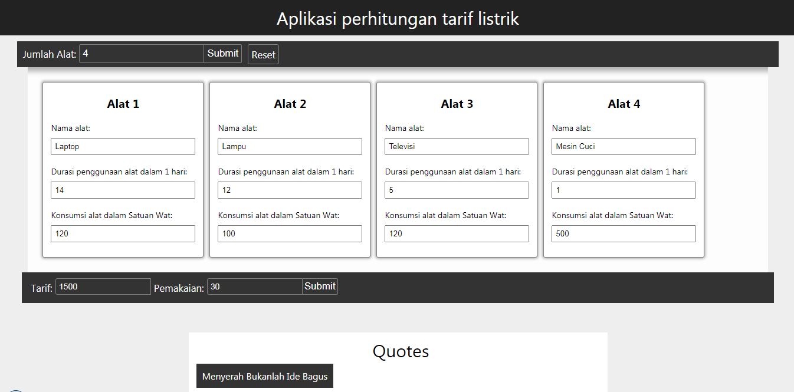
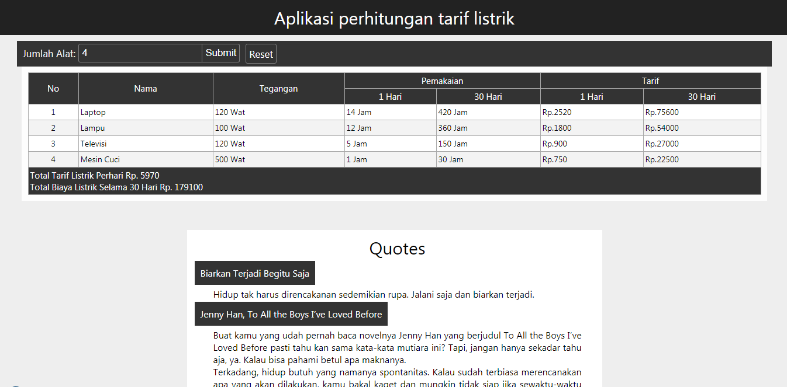

# Aplikasi Untuk menghitung tarif listrik
Aplikasi ini berguna untuk menghitung tarif listrik yang kita gunakan sehari hari, dengan 3 versi yaitu:

lihat: https://iseplutpinur.github.io/Perhitungan_tarif_listrik/

1. Dinamis: Satu halaman dalam folder docs
2. Dinamis: HTML, Javascript
3. Statis: PHP, HTML Dan Javascript

## Contoh:

## Hasil:

# Perhitungan_tarif_listrik
